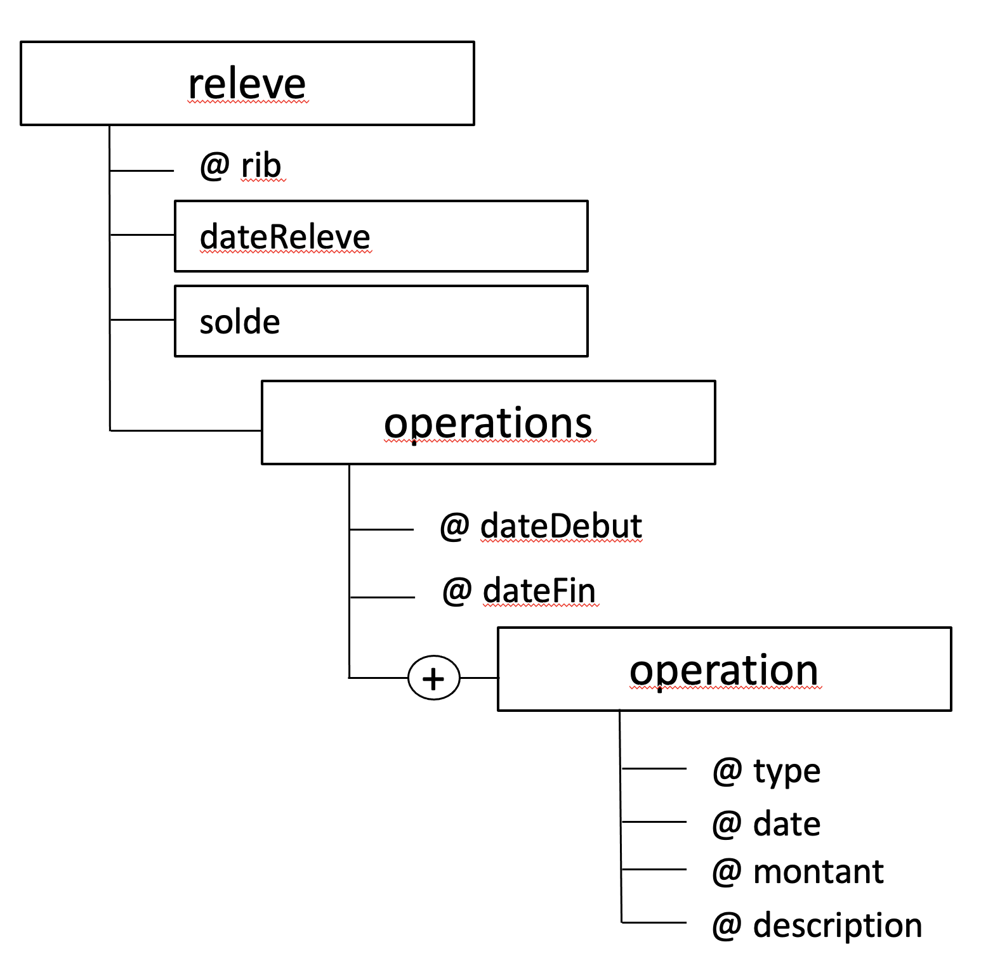
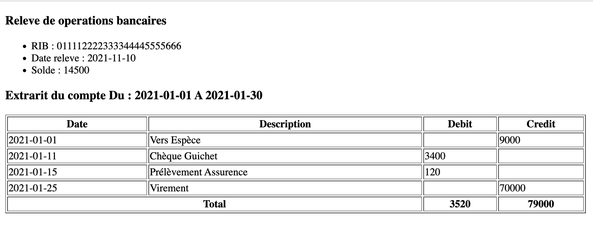
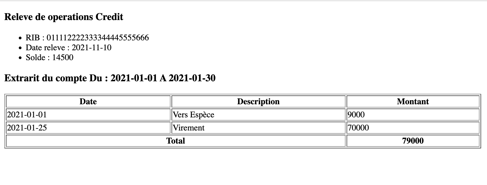
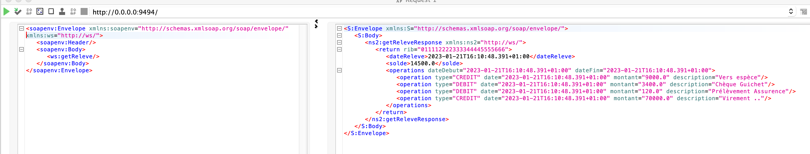

<h1>COMPTE RENDU RELEVE</h1>
<h3>structure graphique de l’arbre XML</h3>

<h3>Resultat de la feuille de style XSL Q4</h3>

<h3>Resultat de la feuille de style XSL Q5</h3>

<h3>Resultat du Test SoapUI </h3>

